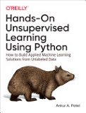

# Books
### My summer reading list

## [Hands-On Unsupervised Learning Using Python](https://www.amazon.com/Hands-Unsupervised-Learning-Using-Python/dp/1492035645)
**Title**		Hands-On Unsupervised Learning Using Python: How to Build Applied Machine Learning Solutions from Unlabeled Data  
**Author**		Ankur A. Patel  
**Publisher**	O'Reilly Media, 2019  
**ISBN**		1492035645, 9781492035640  
**Length**		362 pages